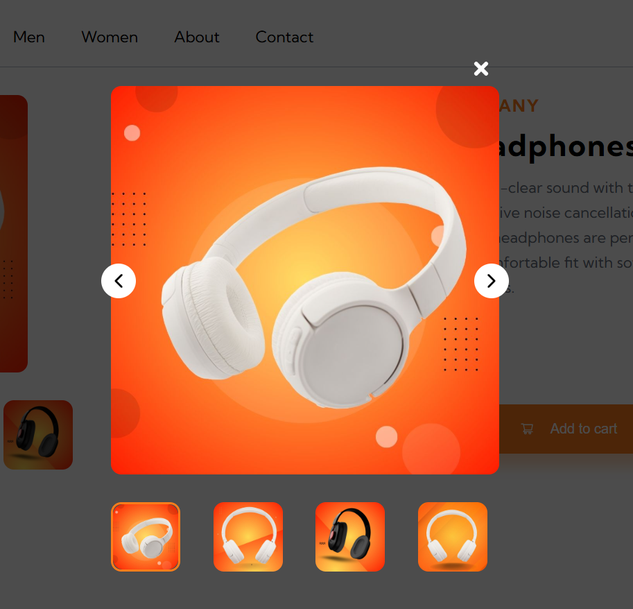

## E-commerce product page // Frontend Mentor Project // React and CSS

- [see project](https://code-yeasin.github.io/ecommerce-product-page/)
- E-commerce Product Page - Feature Overview

Navbar and Sidebar
- Users can navigate using a top Navbar
- Sidebar can be toggled for additional menu access

Product Gallery
- Clicking the main product image opens a lightbox gallery
- On small screens, an image slider carousel is displayed
- Clicking thumbnail images updates the main product display

Shopping Cart
- Users can add products to the cart
- Cart can be viewed and items can be removed
- Cart state is stored in LocalStorage for persistence

    

 

    

 

    

 

    

 

#### Comments about the code

#### Helpers
